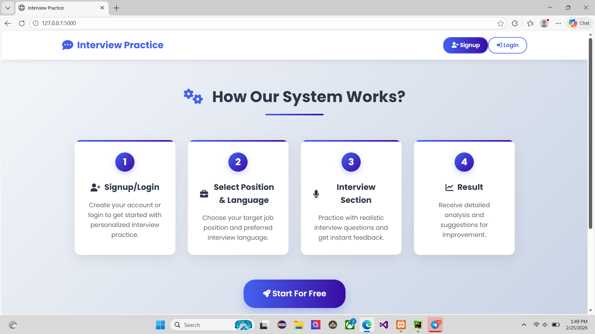
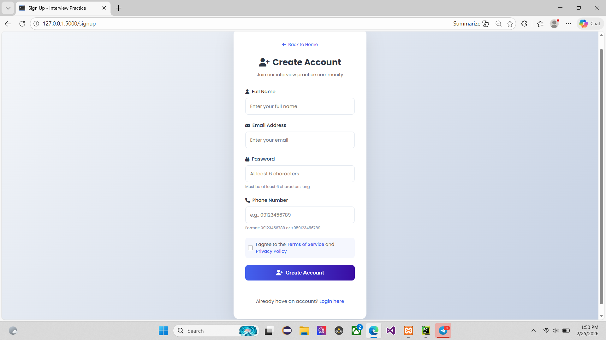
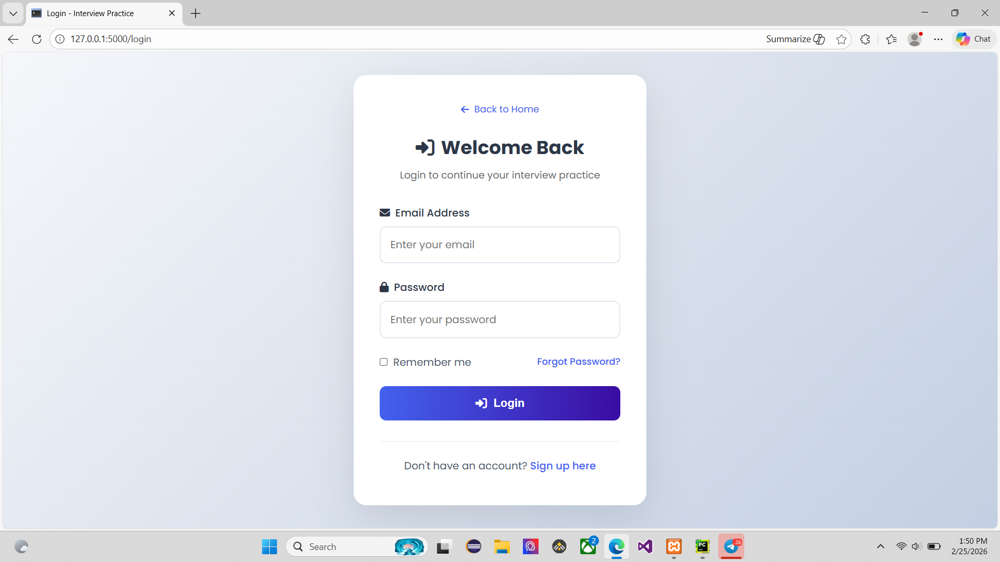
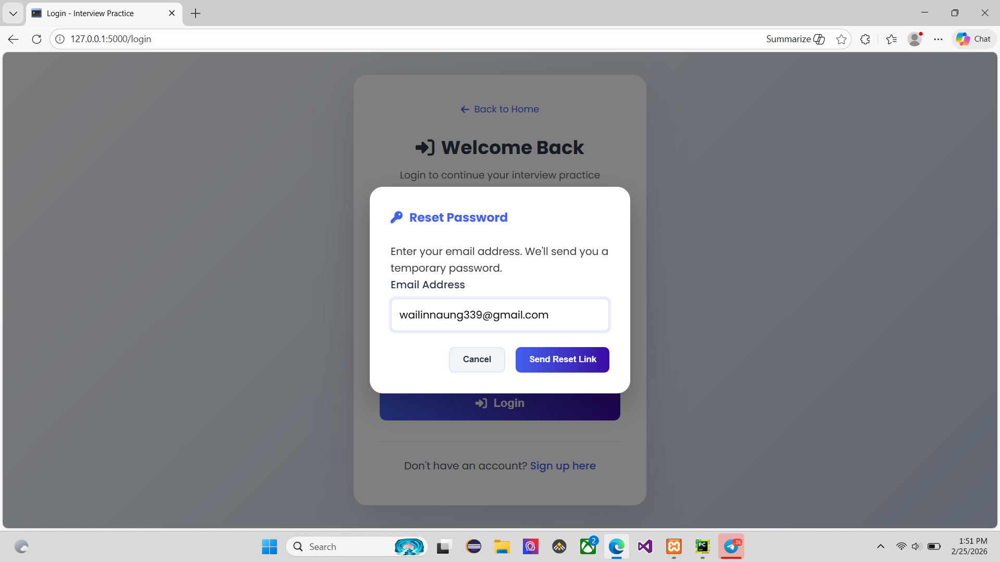
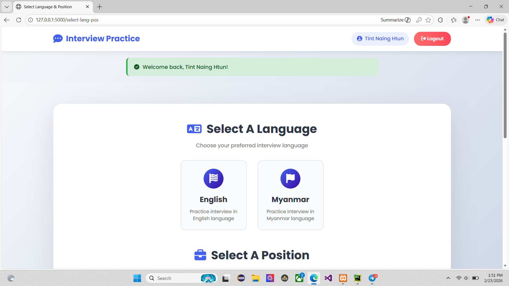
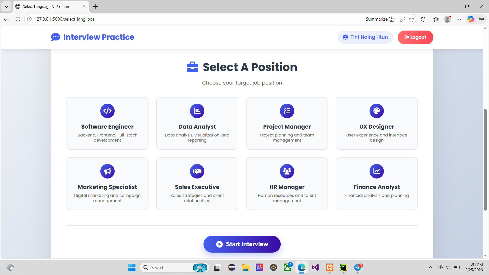

🎯 Job Interview Practice System
A real‑time, AI‑powered web application that simulates a job interview. The system uses your webcam to analyse facial expressions and hand gestures, presents interview questions based on your chosen job role and language, and provides instant feedback with a final score.

📌 Description
This platform helps job seekers practice interviews in a realistic, interactive environment.
You sign up, select a position (e.g., Software Engineer, Data Analyst) and a language (English/Myanmar), then answer randomly selected questions.
While you answer, the system:

Tracks your eye contact and facial expressions to estimate your confidence level.

Recognises hand gestures (👆 one finger, ✌️ two fingers, 🤟 three fingers) to automatically choose answer options.

Keeps progress of answered questions, correct answers, and time spent.

At the end, shows a detailed summary with your confidence score, interview score (20 points per correct answer), and correct answers for the questions you missed.

✨ Features
👤 User Management
User registration with email, name, phone, and password.

Login / Logout with session management.

Forgot password functionality – generates a random temporary password and sends it via email.

🎥 Real‑time Face & Gesture Analysis
Face detection (face-api.js) – detects face, facial landmarks, and expressions.

Eye contact measured via Eye Aspect Ratio (EAR).

Confidence score dynamically calculated from eye contact (30%) and facial expression (70%).

Happy → high score, Fearful/Sad/Angry → low score.

Hand gesture recognition (MediaPipe Hands) – tracks 21 landmarks per hand at ~30 FPS.

1 finger → Answer 1

2 fingers → Answer 2

3 fingers → Answer 3

Automatic answer selection and submission with a short cooldown.

🗂️ Interview Flow
Choose language (English / Myanmar) and position from 8 roles (Software Engineer, Data Analyst, Project Manager, UX Designer, Marketing Specialist, Sales Executive, HR Manager, Finance Analyst).

Each position has 40 questions (20 English + 20 Myanmar), each with 3 answer choices (one correct, two incorrect).

Questions are randomly selected without repetition until 5 questions are answered.

Users can also click the answer buttons manually.

📊 Results & Feedback
Live progress panel shows:

Questions answered

Correct answers count

Accuracy rate

Time elapsed

After 5 questions, a modal displays:

Total correct answers

Average confidence score

Interview score (20 points per correct answer, max 100)

List of incorrectly answered questions with the correct answer for review.

🔒 Security
Passwords are hashed with SHA‑256 before storage.

Session cookies are signed with a Flask secret key.

Input validation (regex) ensures correct email and Myanmar phone number formats.

Email addresses are stored in lowercase to prevent duplicates.

🛠 Tech Stack
Backend
Python 3.11.9 – main language

Flask – web framework

PyMySQL – MySQL database connector

Flask-Mail – email sending (for password reset)

hashlib – password hashing

secrets – secure random password generation

Frontend
HTML5 / CSS3 / JavaScript – structure, styling, interactivity

face-api.js – face detection & expression recognition

MediaPipe Hands – hand landmark tracking and gesture recognition

WebRTC (getUserMedia) – camera access

Font Awesome – icons

Database
MySQL – stores users, positions, questions, and answers

Tables: users, positions, interview_questions, question_answers

🚀 How to Run (Setup Instructions)
1. Prerequisites
Python 3.11.9 installed

MySQL server (e.g., XAMPP, WAMP, or standalone MySQL) running

A Gmail account (or any SMTP) for sending password reset emails (optional, but required for forgot password)

2. Clone the repository
bash
git clone <your-repo-url>
cd Interview   # or your project folder name
3. Create a virtual environment (recommended)
bash
python -m venv venv
# On Windows:
venv\Scripts\activate
# On Mac/Linux:
source venv/bin/activate
4. Install dependencies
bash
pip install -r requirements.txt
(Ensure Flask, PyMySQL, Flask-Mail are listed in requirements.txt.)

5. Configure environment variables / config file
Create a config.py file in the project root with the following content:

python
class Config:
    SECRET_KEY = 'your-secret-key-here'  # change to a strong key
    MYSQL_HOST = 'localhost'
    MYSQL_USER = 'root'
    MYSQL_PASSWORD = ''      # your MySQL password (empty for XAMPP default)
    MYSQL_DB = 'interview_practice_db'

    # Email settings (for password reset)
    MAIL_SERVER = 'smtp.gmail.com'
    MAIL_PORT = 587
    MAIL_USE_TLS = True
    MAIL_USERNAME = 'your-email@gmail.com'
    MAIL_PASSWORD = 'your-app-password'   # use an App Password if 2FA is enabled
    MAIL_DEFAULT_SENDER = 'your-email@gmail.com'
Important: For Gmail, you need to use an App Password if you have 2‑Factor Authentication enabled.

6. Set up the database
Start your MySQL server.

The application automatically creates the database and tables when you run it for the first time.

If you want to pre‑fill the questions and answers, run the provided generate_questions.py scripts (for each position) after the app has created the tables.
Example:

bash
python generate_questions.py
7. Run the Flask application
bash
python app.py
You should see output like:

text
🚀 Initializing database...
✅ Database created/checked
✅ Users table created/checked
...
🚀 Starting Interview Practice Application...
🌐 Open: http://localhost:5000
8. Access the application
Open your browser and go to: http://localhost:5000

📝 Usage Guide
Sign up – Provide a name, email, password, and a valid Myanmar phone number (format: 09XXXXXXXX or +959XXXXXXXX).

Login – Use your email and password.

Select a language and position – Choose English or Myanmar, and one of the 8 job positions.

Start the interview – Click “Start Practice Now” (if logged in) or “Start For Free” (leads to signup).

Allow camera access – The system needs your webcam to analyse your face and hands.

Answer questions – Either click the answer buttons or use hand gestures:

👆 one finger → select answer 1

✌️ two fingers → select answer 2

🤟 three fingers → select answer 3
After a gesture, the answer is automatically submitted.

Progress – Watch your confidence metrics change as your facial expression and eye contact change.

After 5 questions – A modal shows your final results, including wrong answers and corrections.

Forgot password? – On the login page, click “Forgot Password?”, enter your email, and a temporary password will be sent to your inbox.

📁 Project Structure (Simplified)
text
Interview/
├── app.py                    # main Flask application
├── config.py                 # configuration (secret keys, DB, email)
├── requirements.txt          # Python dependencies
├── static/
│   ├── style.css             # main styles
│   ├── interview.css         # styles for interview page
├   ├── position.css          #style for position  
│   └── models/               # face-api.js model files (optional)
├── templates/
│   ├── index.html            # landing page
│   ├── signup.html           # registration form
│   ├── login.html            # login form
│   ├── select_lang_pos.html  # language and position selection
│   └── interview.html        # main interview interface
└── generate_questions.py     # scripts to insert sample questions
📦 Dependencies (requirements.txt)
text
Flask==2.3.3
PyMySQL==1.1.0
Flask-Mail==0.9.1
🧠 Notes
The face detection models are loaded from CDN if local files are missing. For offline use, download the model files from the face-api.js weights repository and place them in static/models/.

Hand gesture recognition uses MediaPipe Hands, which works entirely in the browser – no additional model files needed.

The application is designed for development. For production, consider using a production WSGI server (e.g., Gunicorn) and secure your secret keys.

📄 License
This project is for educational purposes. Feel free to adapt and expand it.

🙌 Acknowledgements
face-api.js

MediaPipe Hands

Flask

Font Awesome

Happy practicing!Love ya! 🚀

## Screenshots

.png)
.png)
.png)
.png)
.png)
.png)
